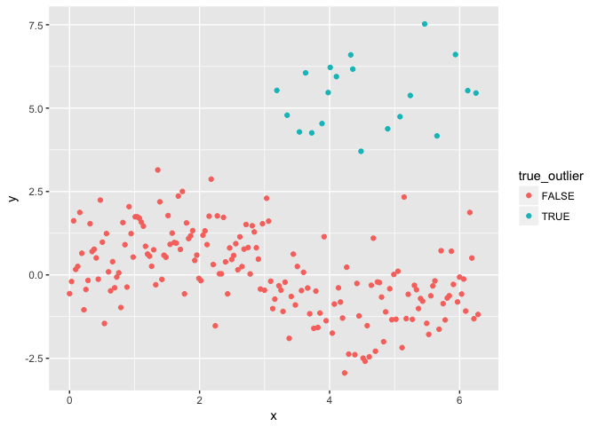
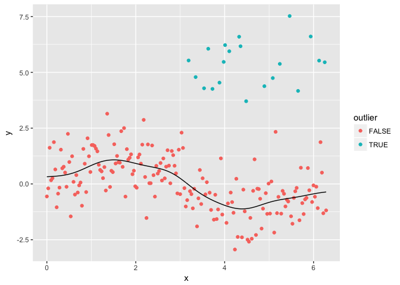
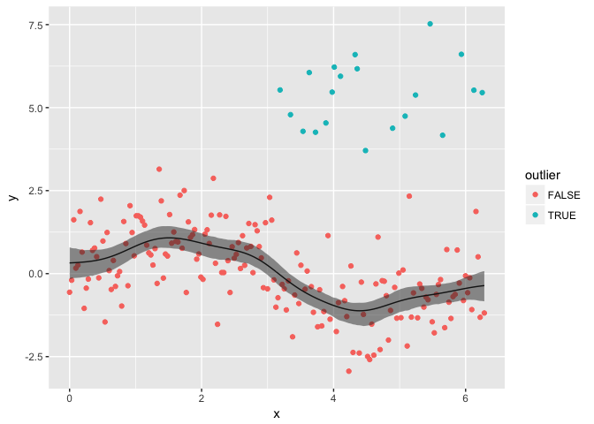

NOIS
================
Hoang Tran
5/9/2017

Non-Parametric Outlier Identification and Smoothing.
----------------------------------------------------

This package implements outlier identification and smoothing for non-linear and time series data.

Installation
------------

``` r
install.packages('devtools')
devtools::install_github('hoangtt1989/NOIS')
```

Simulated Data Example
----------------------

We generate a random sine curve and perturb it with outliers.

``` r
library(dplyr)
library(ggplot2)
library(NOIS)
set.seed(123)
npts <- 200
nout <- floor(.1*npts)

xt <- seq(from=0, to=2*pi, length.out=npts)
gaussnoise <- rnorm(npts)

outliers <- sample(floor(npts/2):npts, size=nout)
randpts <- runif(nout, min=5, max=7)
yt <- sin(xt) + gaussnoise
yt[outliers] <- yt[outliers] + randpts
xt_outliers = xt[outliers]

orig_func <- sin(xt)
data <- data.frame(x = xt, y = yt, true_outlier = xt %in% xt_outliers)

ggplot(data) + geom_point(aes(x, y, color = true_outlier))
```



We use NOIS to detect outliers and estimate the underlying curve. Inputs to this function include a `data.frame` as well as strings specifying which columns contain "x" and "y" values. See the help documentation for `NOIS_fit` for additional information about function inputs.

``` r
sine_fit <- NOIS_fit(data, x = 'x', y = 'y', CV_method = 'LOOCV', pool_q = nout)
sine_fit
```

    ## Number of detected outliers = 20 
    ## Number of observations = 200 
    ## Time = 0.413 
    ## Convergence = TRUE 
    ## MSE = 0.7681321 
    ## Bias corrected MSE = 0.7573429 
    ## First optimal bandwidth = 1.767722 
    ## Pooled optimal bandwidth = 0.4234177

``` r
sine_fit$fit_df
```

    ## # A tibble: 200 x 8
    ##             x          y      y_adj outlier       fit  bias_fit    nr_fit
    ##         <dbl>      <dbl>      <dbl>   <lgl>     <dbl>     <dbl>     <dbl>
    ##  1 0.00000000 -0.5604756 -0.5604756   FALSE 0.4007002 0.3220376 0.6964223
    ##  2 0.03157380 -0.1986089 -0.1986089   FALSE 0.4043660 0.3250921 0.6974081
    ##  3 0.06314759  1.6218139  1.6218139   FALSE 0.4082616 0.3283361 0.6983727
    ##  4 0.09472139  0.1650882  0.1650882   FALSE 0.4124294 0.3318398 0.6993156
    ##  5 0.12629518  0.2552474  0.2552474   FALSE 0.4169148 0.3356803 0.7002363
    ##  6 0.15786898  1.8722790  1.8722790   FALSE 0.4217665 0.3399408 0.7011342
    ##  7 0.18944277  0.6492279  0.6492279   FALSE 0.4270360 0.3447108 0.7020089
    ##  8 0.22101657 -1.0458397 -1.0458397   FALSE 0.4327769 0.3500846 0.7028597
    ##  9 0.25259036 -0.4369399 -0.4369399   FALSE 0.4390444 0.3561608 0.7036863
    ## 10 0.28416416 -0.1653067 -0.1653067   FALSE 0.4458945 0.3630401 0.7044880
    ## # ... with 190 more rows, and 1 more variables: nr_bias_fit <dbl>

We plot the estimated curve and mark the detected outliers. NOIS correctly detects all of the outliers.

``` r
pt <- outlier_plot(sine_fit)
pt
```



We use the predictive residuals bootstrap to construct confidence bands.

``` r
sine_BS <- NOIS_confint(sine_fit, conf_type = 'pred_BS', B = 500, conf_level = .05)
sine_df <- sine_fit$fit_df %>%
  mutate(low_conf = sine_BS$low_predicted,
         up_conf = sine_BS$up_predicted)
pt2 <- ggplot(sine_df) + geom_point(aes(x, y, color = outlier)) + geom_line(aes(x, bias_fit)) + geom_ribbon(aes(x = x, ymin = low_conf, ymax = up_conf), alpha = .5)
pt2
```


